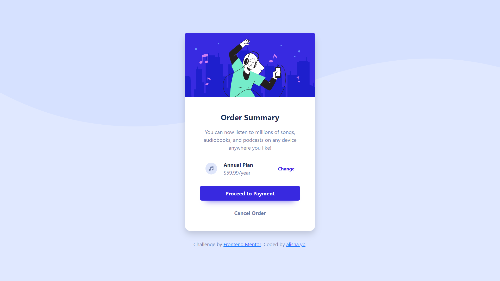

# Frontend Mentor - Order summary card solution

This is a solution to the [Order summary card challenge on Frontend Mentor](https://www.frontendmentor.io/challenges/order-summary-component-QlPmajDUj). Frontend Mentor challenges help you improve your coding skills by building realistic projects. 

## Table of contents

- [Overview](#overview)
  - [The challenge](#the-challenge)
  - [Screenshot](#screenshot)
  - [Links](#links)
- [My process](#my-process)
  - [Built with](#built-with)
  - [What I learned](#what-i-learned)
  - [Continued development](#continued-development)
  - [Useful resources](#useful-resources)
- [Author](#author)

## Overview

### The challenge

Users should be able to:

- See hover states for interactive elements

### Screenshot



### Links

- Solution URL: [Add solution URL here](https://your-solution-url.com)
- Live Site URL: [Frontend Mentor | Order summary card](https://alishayb.github.io/order-summary-card/)

## My process

### Built with

- HTML, CSS
- Bootstrap
- Flexbox

### What I learned

I made this website to review the fundamental of HTML and CSS that I've already learned before. One of the interesting part of this challenge is, of course, the usual 'center the div'. I tried several ways, googling all over the place, wondering why the flexbox didn't work as I intended to be only to find out that the only thing I need to add is just: 
```css
body {
  min-height: 100vh;
}
```
: )

Overall, this challenge is pretty simple but it's quite fun to do!

### Continued development

I will try more difficult challenge that Frontend Mentor have, probably one that involves Javascript to improve my skill more. 

### Useful resources

- [A Complete Guide to Flexbox](https://css-tricks.com/snippets/css/a-guide-to-flexbox/) - I love flexbox. This concept helps tremendously on design and create a layout of a webpage. This website is definitely my go-to resource whenever I design a website.
- [W3School - CSS](https://www.w3schools.com/css/default.asp) - I keep forgetting the syntax haha, bless w3school! 

## Author

- Github - [@alishayb](https://github.com/alishayb)
- Linkedin - [Alisha Yumna](https://www.linkedin.com/in/alisha-yumna-bakri-922682166/)
